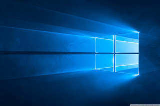
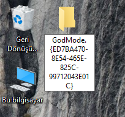
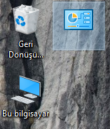

# 🧙‍ Windows'da Gizlenmiş GodMode

Windows'da gizlenmiş bir GodMode olduğunu hiç duymuş muydunuz?

- Bu mod, kullanıcının bütün sistem denetimine tek bir klasörden erişmesini sağlamakta
- GodMode için kısaca; denetim masasın daha da üst seviye yetkili hali veya bir nevi geliştirici modu denebilir.
- Öyle bir mod ki buradan bilgisayarımızda yeni bir disk alanı oluşturabilir, format dahi atabiliriz.

## ❔ Nasıl Yapılır

- Yeni bir klasör açıp
- Adını altta vermiş olduğum gibi değiştirmelisin.
- `GodMode.{ED7BA470-8E54-465E-825C-99712043E01C}`
- Eğer senin de klasörün alttaki resimdeki gibi olduysa başardın demektir.

