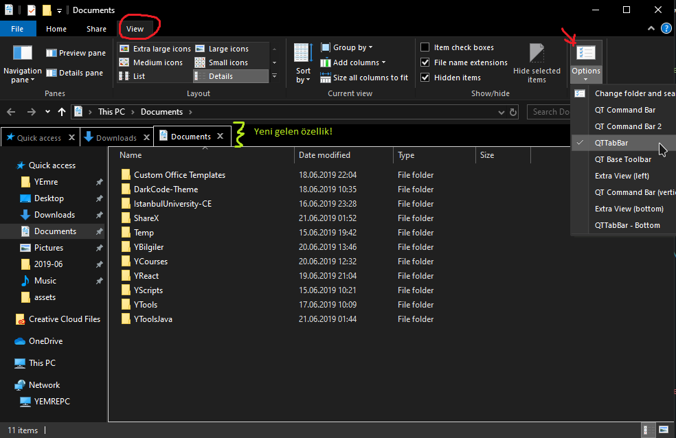
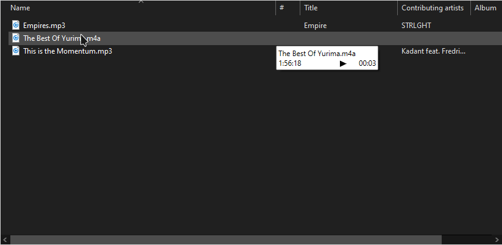

# 🤔 Windows 10 Gelişmiş

## Otomatik Giriş Yapma

Her defasında şifre girişi yapmaz istemezseniz, otomatik şifre girmek sizin için faydalı olacaktır.

* Arama yerine `netplwiz` yazın ve ENTER'a basın
* Çıkan alandaki kutucuğun işaretini kaldırın
* Şifrenizi girin ve onlayın

## Dizin Resmini Değiştirme

Dizin resimleri içerisindeki `desktop.ini` dosyası ile değiştirilmekte

* IconResource alanına `*.ico` resminizin yolunu verin
* `0` değeri ilk resim anlamına gelmektedir, **değiştirmeyiniz**

```text
[.ShellClassInfo]
IconResource=.\instabot.ico,0
[ViewState]
Mode=
Vid=
FolderType=Documents
```

## ⏹ RegEdit Düzenleme Dosyası

Dosyanın uzantısını `.reg` olarak ayarlarsanız register düzenleme dosyası olarak açılır.

* `"`, `\` işareti gibi özel karakterleri kullanmak için `\"`,`\\` yapısını tercih etmelisin

### RegEdit'e Anahtar ve Değer Ekleme

```text
Windows Registry Editor Version 5.00

[HKEY_CURRENT_USER\Software\ZEDA]
[HKEY_CURRENT_USER\Software\ZEDA\TestKey]

"Testval1"="Test 1"
"Testval2"="Test 2"
```

### RegEdit Varsayılan Anahtar Değerini Güncelleme

```text
Windows Registry Editor Version 5.00

[HKEY_CLASSES_ROOT\SystemFileAssociations\image\shell\edit\command]
@="Test val"
```

### RegEdit Anahtar Değeri Silme

```text
Windows Registry Editor Version 5.00

[HKEY_CURRENT_USER\Software\ZEDA\TestKey]

"Testval1"=-
```

### RegEdit Anahtar Silme

```text
Windows Registry Editor Version 5.00

[-HKEY_CURRENT_USER\Software\ZEDA\TestKey]
```

## Resim Düzenleyicisini Değiştirme

* Arama alanına `regedit` yazıp ENTER'a basın
* Çıkan ekranda `Computer\HKEY_CLASSES_ROOT\SystemFileAssociations\image\shell\edit\command` dizinine gelin
* Default adlı anahtarın değerini `"C:\Program Files\paint.net\PaintDotNet.exe" "%1"` olarak değiştirin
  * Orjinal veri: `"%systemroot%\system32\mspaint.exe" "%1"`

> Program yolunu istediğiniz gibi ayarlayabilirsiniz

## Bat Düzenleyiciyi Değiştirme

* `HKEY_CLASSES_ROOT\batfile\shell\edit\command`

> [Stackoverflow kaynağı](https://superuser.com/a/728159/1046035)

## Telemetry'i Kapatma

> Telemetry windows'a geribildirim yapan bir servistir.

* Kapatmak için [bu siteye](https://blogs.systweak.com/how-to-disable-telemetry-and-data-collection-in-windows-10/) bakabilirsin
* İstersen regedit değişimini; alttaki metni `txt`'te kaydedip, uzantısı `reg` yapıp çalıştırarak uygulayabilirsin
* Ya da bu [dosyayı](https://drive.google.com/open?id=1L0-VaRT7FrXauzV49DcQb5jywErS6D36) kullanabilirsiniz. \(Audio gibi algılıyor ama değil, indirip çalıştırın\)

\*.reg dosyası \`\`\`reg Windows Registry Editor Version 5.00 \[HKEY\_LOCAL\_MACHINE\SOFTWARE\Policies\Microsoft\Windows\DataCollection\] "AllowTelemetry"=dword:00000000 \`\`\`

## Windows Store Uygulama Dizini

* Here is the path you should follow: C:Program Files.
* Go to View and check the box next to Hidden items.
* Locate the Windows Apps folder and right-click on it.
* Select Properties from the drop-down menu.
* Select Security. Then select Advanced.
* Go to Owner. There click Change.
* Enter Microsoft account email address.
* Check the box next to ‘Replace owner on subcontainers and objects’.
* Apply your changes.
* Locate and click your account in the list. Click Edit.
* Check the box next to Full Control.

## File Explorer'ı Geliştirme

Alttaki işlem ile file explorer'a hem **tab** hem de **önizleme** fonksiyonu eklebilirsin.

* İlk olarak [QTTabBar](http://qttabbar.wikidot.com/) sitesine girin
* [QTabBar ver 1038](http://qttabbar.wdfiles.com/local--files/qttabbar/QTTabBar_1038.zip)'i indirin
* Ardından update kurulumu olan [QTTabBar ver 1040](http://qttabbar.wdfiles.com/local--files/qttabbar/UpdateQTTabBar1040.zip) ile güncelleyin
* Resimdeki gibi özelleştirebilirsin

> İstersen [buradan](https://www.raymond.cc/blog/how-to-have-tabs-in-your-windows-explorer/) diğer seçenekleri de deneyebilirsin.

 

## Windows 10 Composer

> [Buradan](https://github.com/samhocevar/wincompose) detaylara erişebilirsin.

## Windows10 Karanlık Tema Kurulumu

En çok sevilen karanlık tema olan [Nocturnal](https://www.deviantart.com/chloechantelle/art/Nocturnal-W10-582106490) temasını kurmak için:

* Kurulum dosyasını [buradan](https://www.deviantart.com/download/582106490/d9mkk8q-d0678559-518e-48f3-bf36-30bd91f73496?token=53c9fe62794d3574b12d5aad67c1998665b93c20&ts=1558436081) indirin ve `zip` halinden çıkarın , eğer bu link çalışmaz ise sitesinden erişebilirsiniz
* Güvenlik amaçlı _System Geri Dönüşüm Noktası_ oluşturun
* İndirdiğiniz dosyada `Blank Caption Text` dizine girin ve içerisinde bulunan `Blank.ttf` dosyasına sağ tıklayın ve `Yükle` deyin
* Ardından `Blank.reg` dosyasını çalıştırın
  * Bu değişikliği geri almak isterseniz `Default.reg` dosyasınını kullanabilirsiniz
* `Visual Style` dizinindeki seçtiğiniz bir version ismine sahip olan klasörün **içindekileri** kopyalayın ve `C:\Windows\Resources\Themes` dizinine yapıştırın
* [UltraUXThemePatcher](https://www.deviantart.com/users/outgoing?https://www.syssel.net/hoefs/software_uxtheme.php?lang=en) ile bilgisayarınıza tema yamasını kurun
* _Settings > Personalization > Themes > Select the theme_
* Dosya gezginindeki en üstteki çubuğu kaldırmak \(_ribbon_\) için:
  * [OldNewExplorer](https://tihiy.net/files/OldNewExplorer.rar) programını indirin ve çıkartarak `.exe` uzantılı dosyayı **yönetici olarak** çalıştırın
  * `Use commond bar instead of ribbon` kutucuğunu seçin
    * Altındaki kutucuklardan sadece `Use alternate navigation button style` olanı seçin
  * `Show status bar` kutucuğunun seçimini kaldırın
  * `Install` butonuna tıklayın
* Tüm işlemler bittiğine göre artık, Ayarlar > Kişiselleştirme > Tema kısmından `Nocturnal` temasını seçebilirsiniz

## Windows Saat Sorunu

Windows yanına linux kurulmasında gerçekleşen bu sorunun çözümü **yerel saati** kullanmaktır.

> Alttaki metinleri dosya açıp içine kopyaladıktan sonra, dosya uzantısını `reg` yapın ve çalıştırın.

### Yerel Saati Kullanma

```text
Windows Registry Editor Version 5.00

[HKEY_LOCAL_MACHINE\System\CurrentControlSet\Control\TimeZoneInformation]
"RealTimeIsUniversal"=-
```

### Evrensel \(UTC\) Saati Kullanma

```text
Windows Registry Editor Version 5.00

[HKEY_LOCAL_MACHINE\System\CurrentControlSet\Control\TimeZoneInformation]
"RealTimeIsUniversal"=dword:00000001
```

### Windows Boot Kurtarma

```text
diskpart
list disk
sel disk 0

list vol
sel vol 2
assign letter=G:

cd /d G:\EFI\Microsoft\Boot\
bootrec /fixboot

ren BCD BCD.old
bcdboot C:\Windows /l tr-tr /s G: /f ALL

exit
```

> [Kaynak](https://www.easeus.com/partition-manager-software/fix-uefi-boot-in-windows-10-8-7.html)

## Harici Bağlantılar

* [Windows yanına linux kurulduğunda windows saatinin bozulması](https://www.howtogeek.com/323390/how-to-fix-windows-and-linux-showing-different-times-when-dual-booting/)

