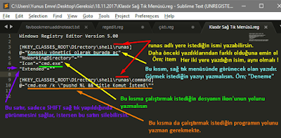
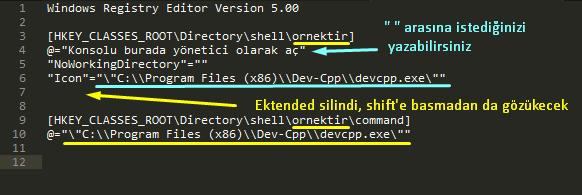
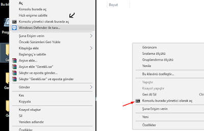
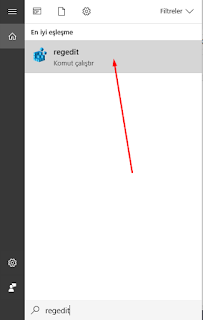
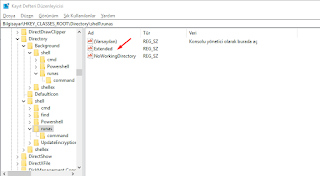
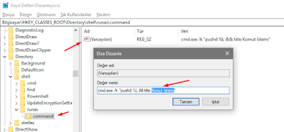
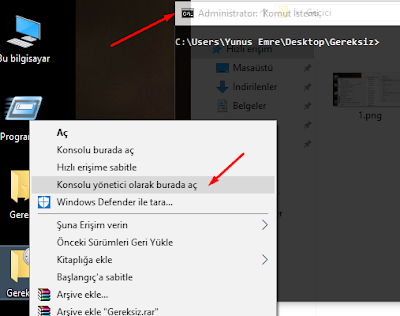
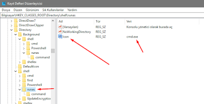
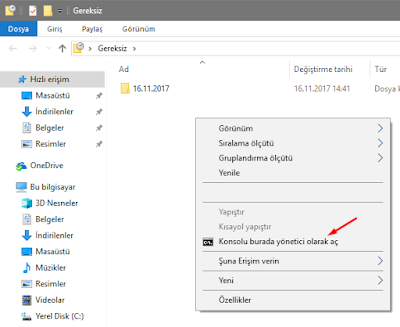
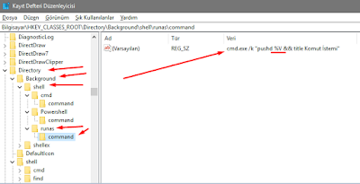

# ✨ Sağ Tık Menüsü Düzenleme Programım

## 🏃‍ Hızlı Yöntem

Dosya oluşturup uzantısını `.reg` yaparak alttaki formatta düzenlemelisin.

* İstediğin programı yol olarak kopyalamak için SHIFT'e basılı tutarak **sağ tıkla**
* `Yol olarak kopyala` seçeneğini seç
* Gelen metindeki `"` karakterlerini `\"` olarak güncelle
  * Örn: `"C:\Program Files (x86)\Dev-Cpp\devcpp.exe"` olan metin `"\"C:\\Program Files (x86)\\Dev-Cpp\\devcpp.exe\""` olmalı
* `[..\command]` altındaki `@=` satırına yapıştırmalısın

 

## 🖤 Consolu Yönetici Olarak Burada Aç Ekleme

Windows'ta komut istemini her hangi bir dosyaya tıkladığınızda sağ tık menüsünde görmek istiyorsanız, yani aşağıdaki fotoğraflardaki gibi 😄

## 🧾 Kayıt Defteri Yapıladırması \(Regedit\)

_Çalıştır_' a `regedit.exe` yazmanız veya _arama çubuğuna_ `regedit` yazmanız ve kayıt defterini **yönetici olarak** açmanız gerekmekte.

* `HKEY_CLASS_ROOT\Directory\shell` dizinine gelip, `shell` dizinine sağ tıklıyoruz -&gt; `Yeni` -&gt; `Anahtar` diyoruz ve adını `runas` yapıyoruz
* `runas` adlı dizine sağ tıklıyoruz -&gt; `Yeni` -&gt; `Dize Değeri` diyoruz
* Oluşturulan `Yeni Değer #1`'i `NoWorkingDirectory` olarak değiştiriyoruz.
* `(Varsayılan)` a çift tıklayıp \(Değiştir\), verisine istediğimiz ismi veriyoruz, ben `Konsolu yönetici olarak burada aç` dedim.
* Sadece SHIFT'e basıldığında gözükmesini istiyorsanız yeni bir dize değeri daha oluşturup `Yeni Değer #2` i `Extended` olarak değiştiriyoruz.
* `runas` dizinine sağ tıklayıp `Yeni` -&gt; `Anahtar` diyoruz ve adını `command` yapıyoruz.
* `command` dizinini açıyoruz ve "\(Varsayılan\)" a çift tıklayarak `cmd.exe /k "pushd %L && title Komut İstemi"` yazıyoruz
* Burada `Komut İstemi` kısmı fark edeceğiniz üzere açılan ekranın başlığı olacaktır, istediğiniz ismi yazabilirsiniz.

Artık herhangi bir klasöre sağ tıkladığınızda "Konsolu yönetici olarak burada aç" veya kendi özelleştirdiğiniz isim yazacaktır, tıklayarak komut istemini yönetici olarak klasör dizininde açabilirsiniz :\)

     

#### 🎴 İkon Ekleme

İkon da eklemek isterseniz; \(Windows Defender'daki kalkan, Winrar'daki kitaplar gibi\):

* `runas` dizinine sağ tıklayıp `Yeni` -&gt;`Dize Değeri` diyoruz ve adını `Icon` yapıyoruz.
* `Icon` a çift tıklayarak verisine `cmd.exe` \(veya hangi ikonu istiyorsanız onun yolunu\) yazıyoruz

Son olarak eklemek isterim ki, bu işlem sadece klasörlere sağ tıkladığımızda karşımıza gelecektir, eğer klasörün içindeyken de sağ tıkladığınızda gelmesini istiyorsanız, yani aşağıdaki resimdeki gibi :\)

Bu sefer yukarıdaki işlemlerin aynısını:

* `HKEY_CLASSES_ROOT\Directory\Background\shell` dizinine yapıyoruz
* Ek olarak `runes/command` dizininin "\(Varsayılan\)" ın verisine `cmd.exe /k "pushd %V && title Komut İstemi"` yazıyoruz. \(L yerine V yazdığımıza dikkat edelim\)

## 🔗 Harici Bağlantılar

* [Penguin Coder](http://www.penguincoders.net/2015/12/add-open-administrator-command-prompt-right-click-folder-windows.html)
* [How to geek](https://www.howtogeek.com/107965/how-to-add-any-application-shortcut-to-windows-explorers-context-menu/)
* Askvg
  * [Link1](https://www.askvg.com/how-to-add-remove-items-from-new-menu-in-windows/)
  * [Link2](https://www.askvg.com/ultimate-tutorial-to-customize-desktop-context-menu-in-windows-vista-server-2008-and-windows-7/)
  * [Link3](https://www.askvg.com/add-cascading-menus-for-your-favorite-programs-in-windows-7-desktop-context-menu/)
* [Stackoverflow](https://stackoverflow.com/questions/20449316/how-add-context-menu-item-to-windows-explorer-for-folders)
* [Visual Studio'u menüde gizleme](https://developercommunity.visualstudio.com/content/problem/26397/disable-context-menu-for-open-in-visual-studio.html)

