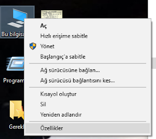
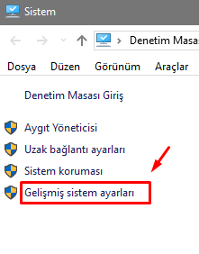
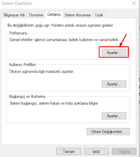
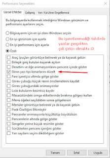

# ⚡ Bilgisayarı Hızlandırma

## 🔰 Giriş

Her birimiz farkındayız ki:

* Bilgisayarlarımız ilk aldığımız hızda çalışmamakta
* Bilgisayarlarımız kullanıldıkça ağırlaşmakta ve istenilen işlemleri daha yavaş yapmakta

Bu sorunu kesin olarak engelleme çözümü sunamasam da size bilgisayarınızı hızlandıracak \(gözle görülür bir değişiklik olacak kadar\) bir kaç uygulama önerebilirim.


🏃‍♂️ Uygulama indirmeden bir işlem yapacağım ben diyorsan, sayfanın en altına inmeni tavsiye ederim


## 🧹 CCleaner

Bilgisayar bakım aracı olan [CCleaner](https://www.ccleaner.com/ccleaner):

* RAM ve kayıt defterini temizleme
* Cookie'leri temizleme
* Başlangıç işlemlerini yönetme

gibi faydalar sunmaktadır.

## 🧱 Defragler

Disk bakım aracı olan Defraggler:

* HDD için disk sıkıştırma
* SSD için optimize etme işlemi \(sıkıştırma zararlıdır\)

gibi faydalar sunmaktadır.

> Kullandıktan sonra gözle görülebilir bir hız artışına tanıklık edeceksiniz.

## 📦 DriverPack Solution

Driver güncelleme aracı olan [DriverPack Solution](http://download.drp.su/17-online/DriverPack-17-Online_88304581.1512049963.exe):

* Eksik _driver_'ları bulma
* _Driver_ güncelleme
* _Driver_'ları güncel tutma

gibi faydalar sunmaktadır.

> Yükleme sırasında ek programlar \(Yandex, Opera, Avast vs. \) indirmekte dikkat ediniz. Ek olarak: `C:\Users\(Kullanıcı)\AppData\Roaming` içindeki **DRP ile başlayan klasörleri siliniz**. Avast `"Win32-Malvare-Gen"` virüsü bulmaktadır.

## 🦢 Programsız Hızlandırma

* Bilgisayarım sağ tıklayın `Özellikler` - `Gelişmiş Sistem Ayarları`
* `Gelişmiş` - `Performans` - `Ayarlar`
* `Görsel Efektler` - `En iyi performans için ayarla`

> Bilgisayara zararı yoktur.

   

