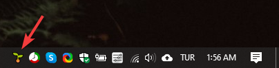

# 🌱 YHotkeys

## 🚀 Proje Sayfası



## 🔰 Ne İşe Yarar

* 👮‍♂️ Windows'un kısıtlı kısayollarına alternatif olarak yapılmıştır
* ✨ Windows 10 üzerinde kişisel kısayollarınızı oluşturmanıza olanak tanır
* 👁‍🗨 Pencereleri **görev çubuğunda** veya **tray icon** olarak gösterip / gizlemenizi sağlar

## 👣 Kullanım Adımları

* ⏬ Uygulamanın son sürümünü [🔗 buradan](https://github.com/yedhrab/YHotkeys/raw/master/src/YHotkeys.exe) indirin
* 🕐 Diğer sürümlere göz atmak için [🏷️ Release](https://github.com/yedhrab/YHotkeys/releases) alanına bakabilirsin
* 🚩 Direkt olarak **Exe** dosyasını çalıştırabilirsiniz

## 🚩 Uygulamayı System ile Başlatma

* ✨ Scriptinizin kısayolunu veya kopyasını oluşturun
* 🎌 ❖ Win R tuşlarına basıp `shell:startup` yazıp ↩ Enter 'a

  basın

* 🚙 Oluşturduğunuz kısayolu veya kopyayı açılan dizine kopyalayın

## 👁‍🗨 Uygulamaya Bakış

## 💞 Kısayollar

### 🔔 Tray Icon Kısayolları

| 🎹 Buton | 📑 Açıklama |
| :--- | :--- |
| ❖ Win E | File Explorer |
| ❖ Win W | Whatsapp Desktop |
| ❖ Win G | GitHub Desktop |
| ❖ Win C | Google Calendar |

### 👀 Küçült / Göster Kısayolları

| 🎹 Buton | 📑 Açıklama |
| :--- | :--- |
| ❖ Win Q | One Note |
| ❖ Win T | Tureng |
| ❖ Win G | GitHub Desktop |

### 📂 Dizin Kısayolları

| 🎹 Buton | 📑 Açıklama |
| :--- | :--- |
| PgDn ⇧ Shift | Startup |
| PgDn d | Downloads |
| PgDn u | Kullanıcı Dizini |

### 🌚 Kişisel Dizin Kısayollarım

| 🎹 Buton | 📑 Açıklama |
| :--- | :--- |
| PgDn g | GitHub |
| PgDn s | Sharex |
| PgDn i | Icons |

### 👨‍🔧 Buton Düzeltmeleri

| 🎹 Buton | 📑 Açıklama |
| :--- | :--- |
| ✲ Ctrl PgDn | Page Down |
| ✲ Ctrl PgUp | Page Up |

## 👨‍💻 Geliştirici Notları

* 👨‍🔧 Kod içerisinde en altta bulunan kısayolları değiştirebilirsin

### 🍍 Kısayol Tanımlamaları

| Sembol | Açıklama |
| :--- | :--- |
| `#` | Win \(Windows logo key\) |
| `!` | Alt |
| `^` | Control |
| `+` | Shift |
| `&` | Birden faza kısayolu birleştirme |

### ✔️ Yapılacaklar

* [ ] 💖 Emoji penceresi [EmojiPedia](https://emojipedia.org/)'daki emojilere göre yapılacak
* [ ] 🏗️ Kullanıcılara arayüzle hotkey yapma imkanı tanınacak

### 🔗 Faydalı Bağlantılar

* [👜 Mağaza Uygulamalarını Komutla Açma](https://windows.yemreak.com/gelistirici-notlarim/magaza-uygulamlarini-komutla-acma)

## 💖 Destek ve İletişim

​[​​](https://github.com/yedhrab) [​​](https://www.linkedin.com/in/yemreak/) [​​](https://yemreak.com/) [​​](mailto::yedhrab@gmail.com?subject=YHotkeys%20%7C%20Github)​

​[​](https://www.patreon.com/yemreak/)

## 🔏 Lisans

**The** [**MIT License**](https://choosealicense.com/licenses/mit/) **© Yunus Emre Ak**

